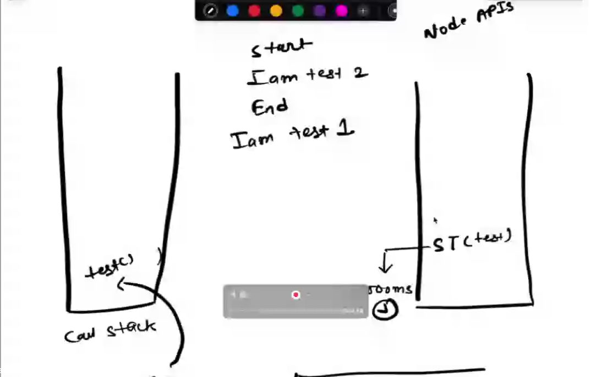
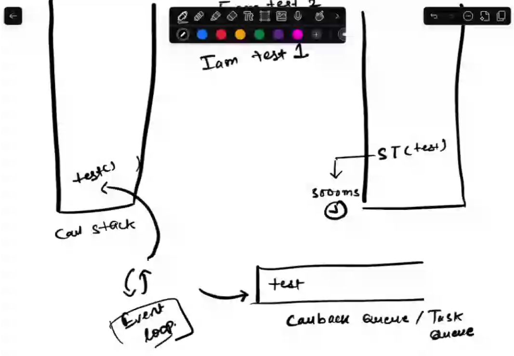

## JavaScript:
1. Single-threaded language: tasks are executed in order,  one task must complete for the next task to start.
2. Dynamic Language

# Synchronous: 
One after another; used single threaded mechanism; blocking architecture.

# NOTE:
*Asynchronous programming is just the opposite of synchronous programming*

# Event Loop:
Handles non-blocking asynchronous requests made by the call backs.

# Doubt: Can we retain the block architecture while also having timeouts??

## Error first callbacks:
Callbacks that handle the error first and the data next, for example: the callback used in the readFile asynchronous method

Asynchronous: not concurrent
Synchronous: not serial